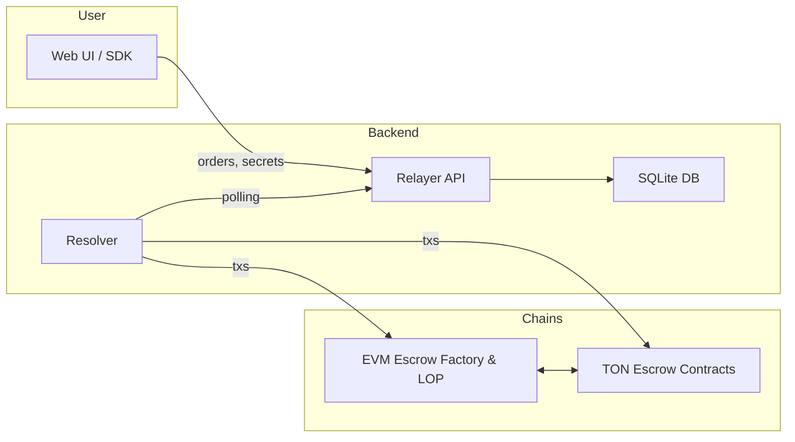

# MoleSwap Monorepo

MoleSwap is an open-source, cross-chain **atomic–swap protocol** that brings seamless liquidity between EVM-compatible chains (Ethereum, Polygon, BSC, etc.) and The Open Network (TON).  
This single repository (“monorepo”) hosts everything required to build, test and run the protocol end-to-end: smart contracts, TypeScript SDK, backend services, deployment scripts and a React / Next.js web interface.

_This project is built in scope of [Unite Defi](https://ethglobal.com/events/unite) Hackathon organized by EthGlobal and 1inch_

---

## ✨ Why MoleSwap?

- **Truly trustless** – assets are locked in on-chain escrows secured by hash-time-locks, so neither party ever loses custody.
- **Cross-ecosystem** – bridges EVM chains with TON out-of-the-box; the plugin system allows additional networks to be added easily.
- **Developer-friendly** – battle-tested SDK, clean REST/WebSocket APIs and rich TypeScript types.
- **Production-ready** – modular architecture, extensive unit & integration tests, CI-ready deployment scripts.

---

## 🗂️ Repository Structure

```
/                                          # ⇩ high-level overview only
├── 1inch-cross-chain-sdk/                 # TypeScript SDK (+ Solidity helper contracts)
├── 1inch-evm-leg-deploy/                  # Foundry scripts for deploying EVM contracts
├── relayer/                               # Order-book & secret-sharing service (Express + SQLite)
├── resolver/                              # Off-chain executor that fills profitable orders
├── ton/                                   # TON smart contracts (Func) + TypeScript wrappers
├── ui/                                    # Next.js web application
├── scripts/                               # End-to-end demo scripts
└── ...                                    # Config, tooling, docs, licences
```

### Component Cheat-Sheet

| Package                          | Description                                                                                                       |
| -------------------------------- | ----------------------------------------------------------------------------------------------------------------- |
| **1inch-cross-chain-sdk**        | Create & sign orders, quote pricing, share secrets, interact with escrows. Published as `@1inch/cross-chain-sdk`. |
| **relayer**                      | Lightweight REST service that stores orders, distributes secrets and validates escrows.                           |
| **resolver**                     | Worker that polls the relayer, evaluates profitability via price oracles and executes swaps on both chains.       |
| **ton**                          | Implementation of MoleSwap escrows and Limit-Order-Protocol in Func; includes compilation & testing harness.      |
| **1inch-evm-leg-deploy**         | Foundry scripts to deploy the Solidity side (LOP, EscrowFactory, Resolver).                                       |
| **ui**                           | User-facing interface to create, track and fill orders. Powered by React (Next.js App Router).                    |
| **scripts/cross-chain-sdk-demo** | Minimal TypeScript examples for EVM ↔ TON swaps.                                                                 |

---

## 🚀 Quick Start

1. **Clone & init submodules**

   ```bash
   git clone https://github.com/<you>/moleswap.git
   cd moleswap
   git submodule update --init 1inch-cross-chain-sdk
   ```

2. **Install root dependencies & run the web-app**

   ```bash
   pnpm install      # or yarn / npm install – monorepo managed via pnpm workspaces
   pnpm dev          # launches Next.js app (http://localhost:3000)
   ```

3. **Start backend services (optional for local testing)**
   ```bash
   # Relayer
   cd relayer && cp env.example .env && pnpm install && pnpm dev
   # Resolver – in a separate terminal
   cd resolver && cp env.example .env && pnpm install && pnpm dev
   ```

> 📝 The UI connects to the relayer at `http://localhost:3000` by default; adjust `.env` files if you run services on different ports.

---

## 🏗️ Development Workflow

| Task                                | Command                                       |
| ----------------------------------- | --------------------------------------------- |
| Run unit tests (all packages)       | `pnpm test -r`                                |
| Lint & type-check                   | `pnpm lint -r && pnpm tsc -b`                 |
| Build every package                 | `pnpm build -r`                               |
| Run TON contract tests              | `cd ton && pnpm test`                         |
| Launch localnet & integration tests | see `tests/` inside **1inch-cross-chain-sdk** |

---

## 🧩 Architecture Overview



1. **Order creation** – Users (via UI or SDK) create signed orders and submit them to the **Relayer**.
2. **Relayer** stores orders, handles secret sharing and exposes REST/WebSocket endpoints.
3. **Resolver** polls the relayer, checks profitability and, when favourable, deploys _source_ & _destination_ escrows on the respective chains.
4. After both escrows are funded, secrets are revealed and assets are swapped atomically.

---

## 📝 License

This project is released under the **MIT License**. See the [LICENSE](LICENSE) file for details.
